# Laravel Nexus

[](https://packagist.org/packages/malikad778/laravel-nexus)
[](https://github.com/malikad778/laravel-nexus/actions?query=workflow%3Arun-tests+branch%3Amain)
[](https://github.com/malikad778/laravel-nexus/actions?query=workflow%3A%22Fix+PHP+code+style+issues%22+branch%3Amain)
[](https://packagist.org/packages/malikad778/laravel-nexus)
[](LICENSE.md)

**A unified, driver-based Laravel package for synchronizing products and inventory across multiple e-commerce channels — Shopify, WooCommerce, Amazon SP-API, and Etsy.**

Laravel Nexus is not a SaaS platform. It is a drop-in Composer package that lives inside your Laravel application, giving you full code-level control over every sync, every webhook, and every rate limit — for free.

---

## Why Laravel Nexus?

The multi-channel commerce problem is real and expensive. When a product sells on Amazon, your Shopify stock must decrement in seconds — not minutes. Every channel has its own API, its own authentication scheme, its own rate limits, and its own webhook signature format. Solving this from scratch takes months.

The existing options leave developers stuck:

| Option | Problem |
|---|---|
| **SaaS (Cin7, Linnworks)** | $300–$500/month, no code control, no custom sync logic |
| **DIY integrations** | 6–12 weeks per channel, brittle, non-reusable |
| **Channel-specific packages** | Siloed — no unified DTO, no cross-channel orchestration |

**Laravel Nexus fills the gap.** It provides a production-grade, extensible foundation — a unified driver interface, a fluent API, distributed rate limiting, secure webhook handling, job batching, and a real-time dashboard — all installable in minutes via Composer.

---

## Features

### 🔌 Driver-Based Architecture
Every channel implements the same `InventoryDriver` interface. Your application code never touches a channel SDK directly. Add support for a new channel (eBay, TikTok Shop, Walmart) by implementing one interface and registering one class — zero changes to the core.

```php
// Identical API regardless of channel
Nexus::driver('shopify')->fetchProduct($remoteId);
Nexus::driver('amazon')->updateInventory($remoteId, 42);
Nexus::driver('woocommerce')->getProducts(now()->subHours(24));
```

### 🔄 Fluent Sync API
A clean, chainable builder API for common sync operations:

```php
// Push a single inventory update to specific channels
Nexus::product($product)
    ->updateInventory(quantity: 42)
    ->sync(['shopify', 'amazon']);

// Bulk sync your entire catalog across all channels
$batch = Nexus::catalog($products)->syncAll();

// Monitor batch progress
$status = Nexus::batch($batchId)->status();
```

### ⚡ Distributed Rate Limiting
Each channel enforces API rate limits at the key level — not the server level. Run 10 queue workers and a naive implementation blows through your API quota in seconds. Nexus solves this with a **Token Bucket algorithm backed by atomic Redis Lua scripting**, race-condition-free across any number of concurrent workers.

| Channel | Rate Limit | Burst Capacity |
|---|---|---|
| Shopify | 2 req/sec | 40 tokens |
| WooCommerce | 25 req/sec | 100 tokens |
| Amazon SP-API | 1 req/sec | 10 tokens |
| Etsy | 10 req/sec | 50 tokens |

### 📦 Three-Layer Job Architecture
Syncing 10,000 SKUs across 4 channels means 40,000 API calls. Nexus handles this with a structured job hierarchy using Laravel's `Bus::batch()`:

- **`CatalogSyncJob`** — Orchestrator. Partitions the catalog, creates the batch, registers `then()` and `catch()` callbacks.
- **`ChannelSyncBatchJob`** — Channel executor. Acquires rate limit tokens, dispatches push jobs, fires lifecycle events.
- **`PushInventoryJob`** — Atomic unit per SKU/channel pair. Implements `ShouldBeUnique` to prevent duplicate in-flight jobs.

### 🔒 Secure Unified Webhook Receiver
A single route handles all four channels. Every request is cryptographically verified before processing:

- **Shopify** — `X-Shopify-Hmac-Sha256` — HMAC-SHA256 (base64)
- **WooCommerce** — `X-WC-Webhook-Signature` — HMAC-SHA256 (base64)
- **Amazon** — `X-AMZ-SNS-Signature` — RSA-SHA1 via AWS SNS (certificate downloaded, domain-validated, cached)
- **Etsy** — `X-Etsy-Signature` — HMAC-SHA256 (hex)

```
POST https://your-app.com/nexus/webhooks/shopify
POST https://your-app.com/nexus/webhooks/woocommerce
POST https://your-app.com/nexus/webhooks/amazon
POST https://your-app.com/nexus/webhooks/etsy
```

### 📡 Standardized Event System
Once a webhook is verified, a single `InventoryUpdated` event fires — regardless of which channel triggered it. Write one listener to handle all channels:

```php
class PropagateInventoryToOtherChannels
{
    public function handle(InventoryUpdated $event): void
    {
        $others = ['shopify', 'amazon', 'woocommerce', 'etsy'];

        Nexus::product($event->product)
            ->updateInventory($event->newQuantity)
            ->sync(array_diff($others, [$event->channel]));
    }
}
```

Full lifecycle hooks at every stage of the pipeline:

| Event | Fires When |
|---|---|
| `BeforeInventorySync` | Before each channel push — ideal for safety stock rules |
| `AfterInventorySync` | On success — notify WMS, trigger downstream workflows |
| `InventorySyncFailed` | On permanent failure after retries — alert Slack, PagerDuty |
| `InventoryUpdated` | After every verified webhook |
| `WebhookReceived` | Before processing — full audit logging |
| `ChannelThrottled` | When a channel API is throttling — broadcasts via Laravel Reverb |
| `ProductImported` | When a product is fetched from a channel during catalog import |

### 🗄️ Polymorphic Channel Mapping
Any Eloquent model becomes syncable with one trait — no schema changes to your existing tables:

```php
use Malikad778\\LaravelNexus\Traits\Syncable;

class Product extends Model
{
    use Syncable;
    // Adds: $product->channelMappings(), $product->syncTo('shopify')
}
```

The `nexus_channel_mappings` table stores each channel's remote ID against your local model using a polymorphic relationship with a composite unique index, preventing duplicate mappings.

### 💀 Dead Letter Queue
Jobs that exhaust all retries are written to `nexus_dead_letter_queue` with their full serialized payload and exception detail. No silent failures. From the dashboard you can replay individual jobs or bulk-replay after an API outage — no artisan required.

### 📊 Real-Time Livewire Dashboard
A Livewire 3 dashboard at `/nexus` with wire:poll.3s real-time updates:

- **Channel Status Cards** — Connected / Throttled / Disconnected, with live token bucket fill level per channel
- **Sync Job Monitor** — Active `Bus::batch()` instances with per-job progress
- **Webhook Event Log** — Paginated, searchable log of every inbound webhook with verification status and processing duration
- **Dead Letter Queue Manager** — Replay or resolve failed jobs with one click
- **Real-Time Alerts** — `ChannelThrottled` broadcasts via Laravel Reverb when rate limiting is detected

### 🔧 Extensible Driver System
Register community-contributed or internal channel drivers without touching the package core:

```php
// In AppServiceProvider::boot()
Nexus::extend('ebay', function ($app) {
    return new EbayInventoryDriver(
        config: $app['config']['nexus.channels.ebay'],
        client: $app->make(EbayApiClient::class)
    );
});

// eBay is now a first-class channel
Nexus::product($product)->updateInventory(10)->sync(['shopify', 'ebay']);
```

### 🧩 Normalized Product DTOs
Channel-specific product structures are normalized into a single `NexusProduct` DTO, eliminating transformation logic from your application:

```php
NexusProduct::fromShopify($payload);     // variants[], inventory_item_id, barcode
NexusProduct::fromWooCommerce($payload); // stock_quantity, variations[]
NexusProduct::fromAmazon($payload);      // ASIN, seller_sku, quantity
NexusProduct::fromEtsy($payload);        // listing_id, skus[], price divisor
```

The `channelMeta` field preserves the raw channel payload so channel-specific data (Amazon FBA routing, Etsy listing state) is never permanently discarded.

---

## Requirements

- PHP 8.2+
- Laravel 12+
- Redis (for rate limiting and queues)
- MySQL 8+ or PostgreSQL

---

## Installation

```bash
composer require malikad778/laravel-nexus
```

Publish the config file and migrations:

```bash
php artisan vendor:publish --tag="nexus-config"
php artisan vendor:publish --tag="nexus-migrations"
php artisan migrate
```

---

## Configuration

Add channel credentials to your `.env`:

```dotenv
# Shopify
SHOPIFY_SHOP_URL=your-shop.myshopify.com
SHOPIFY_ACCESS_TOKEN=shpat_...
SHOPIFY_WEBHOOK_SECRET=whsec_...
SHOPIFY_LOCATION_ID=...

# WooCommerce
WOOCOMMERCE_STORE_URL=https://your-store.com
WOOCOMMERCE_CONSUMER_KEY=ck_...
WOOCOMMERCE_CONSUMER_SECRET=cs_...
WOOCOMMERCE_WEBHOOK_SECRET=...

# Amazon SP-API
AMAZON_CLIENT_ID=amzn1.application-oa2-client...
AMAZON_CLIENT_SECRET=...
AMAZON_REFRESH_TOKEN=Atzr|...
AMAZON_SELLER_ID=...
AMAZON_ACCESS_KEY_ID=...
AMAZON_SECRET_ACCESS_KEY=...
AMAZON_REGION=us-east-1

# Etsy
ETSY_KEYSTRING=...
ETSY_SHARED_SECRET=...
ETSY_SHOP_ID=...
ETSY_WEBHOOK_SECRET=...
```

See `config/nexus.php` for rate limit overrides, dashboard middleware, and queue configuration.

---

## Usage

### Sync a Single Product

```php
use Malikad778\\LaravelNexus\Facades\Nexus;

// All configured channels
Nexus::product($product)->updateInventory(quantity: 42)->sync();

// Specific channels only
Nexus::product($product)->updateInventory(quantity: 42)->sync(['shopify', 'amazon']);
```

### Bulk Catalog Sync

```php
$batch = Nexus::catalog($products)->syncAll();
```

### Access Drivers Directly

```php
$product  = Nexus::driver('shopify')->fetchProduct('gid://shopify/Product/789');
$products = Nexus::driver('woocommerce')->getProducts(now()->subHours(24));
$success  = Nexus::driver('etsy')->pushInventory($nexusInventoryUpdate);
```

### Listen to Events

```php
// In EventServiceProvider
protected $listen = [
    \Malikad778\\LaravelNexus\Events\InventoryUpdated::class => [
        PropagateInventoryToOtherChannels::class,
    ],
    \Malikad778\\LaravelNexus\Events\BeforeInventorySync::class => [
        EnforceSafetyStockListener::class,
    ],
    \Malikad778\\LaravelNexus\Events\InventorySyncFailed::class => [
        AlertOpsTeamListener::class,
    ],
    \Malikad778\\LaravelNexus\Events\ProductImported::class => [
        CreateLocalProductListener::class,
    ],
];
```

### Make Your Model Syncable

```php
use Malikad778\\LaravelNexus\Traits\Syncable;

class Product extends Model
{
    use Syncable;
}

// Access channel mappings
$shopifyId = $product->channelMappings()->where('channel', 'shopify')->value('remote_id');
```

### Dashboard

Visit `/nexus`. Secure it in `config/nexus.php`:

```php
'dashboard_middleware' => ['web', 'auth'],
```

### Queue Workers

```bash
php artisan queue:work redis --queue=nexus,default
```

---

## Architecture Overview

```mermaid
graph TD
    A[Your Application] -->|Nexus::product / catalog| B(InventoryManager)
    B --> C{InventoryDriver}
    C -->|REST + HMAC| D[ShopifyDriver]
    C -->|REST v3 + Basic Auth| E[WooCommerceDriver]
    C -->|SP-API + AWS SigV4| F[AmazonDriver]
    C -->|OAuth2 PKCE| G[EtsyDriver]

    H[Inbound Webhooks] -->|Signed Payload| I[VerifyNexusWebhookSignature]
    I -->|Verified| J[WebhookController]
    J -->|InventoryUpdated event| K[Your Listeners]
    K -->|Nexus::product| B

    L[CatalogSyncJob] -->|Bus::batch| M[ChannelSyncBatchJob × channels]
    M -->|Token acquired| N[PushInventoryJob × SKUs]
    N -->|Exhausted retries| O[(nexus_dead_letter_queue)]

    P[TokenBucket] -->|Lua atomic eval| Q[(Redis)]
    M --> P
```



---

## Database Tables

| Table | Purpose |
|---|---|
| `nexus_channel_mappings` | Polymorphic map between local models and remote channel IDs |
| `nexus_sync_jobs` | Active and historical job tracking with batch IDs and status |
| `nexus_dead_letter_queue` | Permanently failed jobs with full payload for one-click replay |
| `nexus_webhook_logs` | Audit log of every inbound webhook with verification status |
| `nexus_rate_limit_logs` | Per-channel rate limit event tracking for dashboard visibility |

---

## Testing

```bash
composer test
```

---

## Changelog

Please see [CHANGELOG](CHANGELOG.md) for recent changes.

## License

The MIT License (MIT). Please see [License File](LICENSE.md) for more information.
